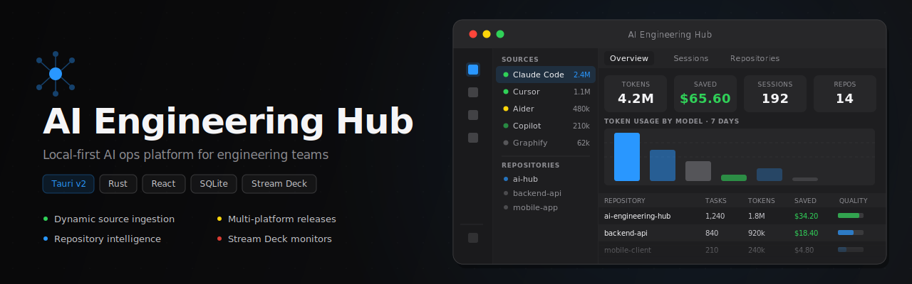
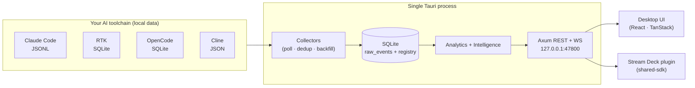

<div align="center">



[](https://github.com/saeedkolivand/ai-engineering-hub/actions/workflows/ci.yml)
[](https://github.com/saeedkolivand/ai-engineering-hub/releases)
[](LICENSE)
[](https://www.rust-lang.org/)
[](https://tauri.app/)
[](https://react.dev/)
[](https://www.typescriptlang.org/)
[](CONTRIBUTING.md)

**An operations platform for your AI coding toolchain.**
Ingests metrics from any AI dev tool, computes analytics + repository intelligence, and serves a
local API/WebSocket — consumed by its own desktop UI and a companion Stream Deck plugin.

[Install](#install) · [Getting started](docs/getting-started.md) · [Documentation](docs/README.md) · [Architecture](docs/architecture.md) · [API](docs/api.md) · [Contributing](CONTRIBUTING.md)

</div>

---

## What is this?

You run a fleet of AI coding tools — Claude Code, Cline, OpenCode, RTK, Graphify, and whatever
else. Each one quietly accumulates usage, savings, and quality signals in its own local format,
and none of them talk to each other. **AI Engineering Hub** is the single pane of glass over all
of them.

It's a **local-first desktop app** (one Tauri process) that:

- **Collects** metrics from each tool's own data store — no manual instrumentation.
- **Computes** dimensional analytics (tokens, savings, productivity, quality, retrieval) and
  repository intelligence (hotspots, expensive agents, retrieval bottlenecks).
- **Serves** a fixed local API + WebSocket (`127.0.0.1:47800`) that powers both the desktop UI
  and an Elgato Stream Deck plugin.

> **Design bar:** GitHub / Linear / Datadog density with Apple-grade restraint — an operational
> tool, not a KPI marketing dashboard.

## Highlights

- 🔌 **Dynamic sources, zero recompile.** Tools are rows in a registry, not a hardcoded enum.
  Built-in collectors ship for the popular tools; unknown tools auto-register and can be mapped
  from the UI or fed over HTTP. → [Integrations](docs/integrations.md)
- 📊 **Dimensional analytics.** Every metric groups by `source` / `provider` / `agent` /
  `repository`. Rates that no tool reports show "—" (honest), never a fake `0%`. → [Analytics](docs/analytics.md)
- 🧭 **Drill-down everywhere.** Repository → Session → Task → Agent, tables-first, with a
  `⌘/Ctrl-K` command palette and a live activity feed.
- 🎛️ **Stream Deck plugin.** 9 hardware monitors driven by the same API — no log parsing, no DB
  access. → [Stream Deck](docs/streamdeck.md)
- 🎨 **Apple-derived design system** with light / dark / system theming, shipped as shared
  tokens. → [Design system](docs/design-system.md)
- 🦀 **One process, no sidecars.** Rust core (Axum + SQLx + SQLite) runs inside Tauri; the
  frontend is embedded. Nothing else to deploy.

## Install

Pre-built installers are published automatically on every release via GitHub Actions. No build
toolchain required.

### macOS

**Homebrew (recommended)**

```bash
brew tap saeedkolivand/ai-engineering-hub https://github.com/saeedkolivand/ai-engineering-hub
brew install --cask ai-engineering-hub
```

To update:

```bash
brew update && brew upgrade --cask ai-engineering-hub
```

The cask lives in [`Casks/ai-engineering-hub.rb`](Casks/ai-engineering-hub.rb) in this repo and
is updated automatically after every release. The app also notifies you in-app when an update is
available.

**Direct download**

Download the `.dmg` from the [latest release](https://github.com/saeedkolivand/ai-engineering-hub/releases/latest).
Apple Silicon (arm64) and Intel (x86\_64) builds are both available.

### Windows

Download the `.msi` (recommended) or `.exe` (NSIS) installer from the
[latest release](https://github.com/saeedkolivand/ai-engineering-hub/releases/latest).

**winget** *(coming soon)*

```powershell
winget install saeedkolivand.AIEngineeringHub
```

### Linux

Download the `.AppImage` from the
[latest release](https://github.com/saeedkolivand/ai-engineering-hub/releases/latest), make it
executable, and run it:

```bash
chmod +x AI.Engineering.Hub_*.AppImage
./AI.Engineering.Hub_*.AppImage
```

A `.deb` package is also available for Debian/Ubuntu systems.

### Auto-update

Once installed, the app checks for updates on launch and prompts you to install them in-place.
Updates are signed — the public key is pinned in the app binary and verified before any update is
applied.

---

## Architecture at a glance



Tools write to their own stores → collectors normalize them into `raw_events` → analytics serve
the API → the UI and plugin consume it. See [docs/architecture.md](docs/architecture.md) for the
full picture and the design decisions behind it.

## Quick start

**Prerequisites:** Rust (stable), Node 20+, [pnpm](https://pnpm.io/) 11. (On Windows you also
need WebView2 + MSVC Build Tools — both standard.)

```bash
pnpm install
pnpm app:dev      # the full desktop app: UI + Hub API + collectors, one process
```

Enable your tools under **Integrations**, and data flows in within ~5s. Prefer the browser for
UI work? Run the API and UI separately:

```bash
pnpm dev:hub      # terminal 1 — Hub API on 127.0.0.1:47800
pnpm dev          # terminal 2 — Vite UI on :5173
```

Full walkthrough → [docs/getting-started.md](docs/getting-started.md).

## Project layout

```
apps/
  ai-engineering-hub/
    core/          Rust core (Tauri-free): Axum, SQLx/SQLite, ingestion, analytics, intelligence
    src-tauri/     Tauri v2 shell — owns the process, spawns the core server, embeds the UI
    src/frontend/  React + TanStack renderer (Vite SPA)
  streamdeck-plugin/  Elgato Stream Deck plugin (consumes the Hub API/WS only)
packages/
  shared-types/        domain + analytics types (TS + Rust mirrors)
  shared-events/       EventEnvelope + WS/ingest contracts (TS + Rust mirrors)
  shared-api-contracts/ request/response shapes for every endpoint (TS)
  shared-sdk/          typed client over the contracts (used by the plugin)
  shared-design-tokens/ Apple-derived design tokens (CSS + TS)
```

## Scripts

| Command | What it does |
| --- | --- |
| `pnpm app:dev` | Run the integrated desktop app (UI + API + collectors) |
| `pnpm app:build` | Build the desktop installer (MSI + NSIS on Windows) |
| `pnpm dev:hub` | Run the Hub API headless (for browser dev) |
| `pnpm dev` | Run the Vite UI dev server |
| `pnpm build` | Build all JS workspaces (Turbo) |
| `cargo build --workspace` | Build the Rust workspace |
| `pnpm --filter ai-engineering-monitor-plugin sd:pack` | Package the Stream Deck plugin |

## Documentation

Everything lives in **[docs/](docs/README.md)**:

| Guide | |
| --- | --- |
| [Getting started](docs/getting-started.md) | Install, run, enable a tool, see data |
| [Architecture](docs/architecture.md) | Process model, bounded contexts, data flow |
| [API reference](docs/api.md) | REST + WebSocket, types, errors |
| [Database](docs/database.md) | Schema, ERD, indexes, migrations |
| [Analytics](docs/analytics.md) | Metric catalog, dimensions, "—" semantics |
| [Integrations](docs/integrations.md) | Collectors, supported tools, write your own |
| [Design system](docs/design-system.md) | Tokens, theming, density |
| [Stream Deck](docs/streamdeck.md) | Monitors, build, package, install |
| [Configuration](docs/configuration.md) | Ports, data dir, settings |
| [Deployment](docs/deployment.md) | Release builds + packaging |
| [Troubleshooting](docs/troubleshooting.md) | Common issues |
| [Contributor guides](docs/guides/) | Add a source / metric / endpoint / route / monitor |

## Contributing

Contributions are welcome! Read **[CONTRIBUTING.md](CONTRIBUTING.md)** for the dev setup, the
architectural invariants (they're load-bearing), and the PR workflow. Please also review the
[Code of Conduct](CODE_OF_CONDUCT.md).

## Security

The Hub binds to `127.0.0.1` only and never sends your data anywhere. To report a vulnerability,
see [SECURITY.md](SECURITY.md).

## License

[MIT](LICENSE) © AI Engineering Hub contributors.
