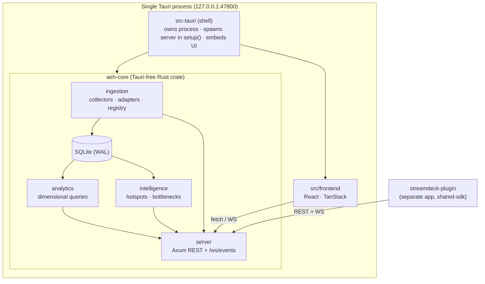
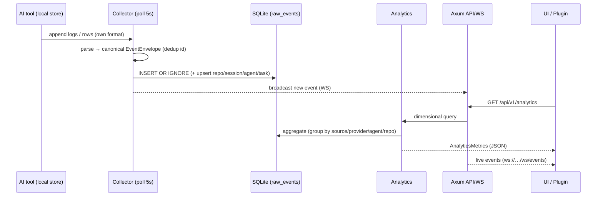

# Architecture

AI Engineering Hub is a **single-process, local-first desktop application**: a Tauri v2 shell
that hosts a Rust core (Axum + SQLx + SQLite) and embeds a React UI. A companion Stream Deck
plugin is the only separate app, and it talks to the Hub over the same local API everything else
uses.

## Process & component model



| Layer | Tech | Responsibility | Location |
| --- | --- | --- | --- |
| Core | Rust · Axum · Tokio · SQLx · SQLite | API, ingestion, analytics, intelligence | `apps/ai-engineering-hub/core` (`aeh-core`) |
| Shell | Tauri v2 | Owns the process; spawns the server in `setup()`; embeds the UI | `apps/ai-engineering-hub/src-tauri` |
| Frontend | React · TanStack Router/Query/Table/Virtual/Form/Store | Three-panel operational UI | `apps/ai-engineering-hub/src/frontend` |
| Plugin | Elgato SDK v2 | 9 hardware monitors via `shared-sdk` | `apps/streamdeck-plugin` |
| Contracts | TS + Rust mirrors, SDK, tokens | Single source of truth | `packages/*` |

The core is a **Tauri-free library** so it can be run headless (`cargo run -p aeh-core --example
serve`) and tested without the desktop shell. The shell is deliberately thin — see
[src-tauri/src/main.rs](../apps/ai-engineering-hub/src-tauri/src/main.rs).

## Data flow



1. **Ingestion.** Three source-agnostic paths feed one `ingest` core: pull-based **collectors**
   (read each tool's own store), **HTTP push** (`POST /api/v1/ingest`), and a file watcher. Every
   event is a canonical `EventEnvelope` with a deterministic id, so re-scans and restarts are
   idempotent (`INSERT OR IGNORE`).
2. **Storage.** Events land in `raw_events` (JSON payload). Collectors also upsert the drill-down
   entities (`repositories`, `sessions`, `tasks`, `agents`).
3. **Analytics & intelligence.** Computed on demand over `raw_events` with `source` / `provider`
   / `agent` / `repository` as independent dimensions.
4. **Serving.** Axum exposes REST + a `/ws/events` broadcast. The UI (TanStack Query) and the
   plugin (`shared-sdk`) consume the same endpoints.

## Bounded contexts (Rust modules)

```
core/src/
  ingestion/      sources registry, adapters, collectors, file watcher
  analytics.rs    dimensional metric queries
  intelligence.rs hotspots / bottlenecks
  server.rs       Axum routes + WebSocket
  models.rs       entity row structs + list queries (repository pattern)
  sources.rs      dynamic source registry
  state.rs        AppState (pool + broadcast Sender) — dependency injection
  db.rs           pool init, WAL pragmas, migrations
  error.rs        typed errors (thiserror)
```

## Design principles

- **One process, no sidecars.** The whole Hub is the Tauri process. No Node/Python/Go services,
  no helper executables.
- **Sources are data, not code.** Tools are registry rows + capabilities + mapping rules; the
  named tools are seed presets, not branches. New tools need **zero recompile**.
- **`source` ≠ `provider` ≠ `agent`.** Three independent analytics dimensions.
- **Single source of truth.** Contracts live in `packages/*` with TS↔Rust parity.
- **Honest data.** No mock numbers; metrics with no reporting tool render "—", not `0%`.
- **Observability.** Typed errors + `tracing` spans; SQLite work stays off the hot path.

## Why these choices

| Decision | Rationale |
| --- | --- |
| Axum on a **fixed localhost port** inside Tauri | The Stream Deck plugin is a separate process and needs the same API the UI uses — while staying "one app". |
| **SQLite + WAL** | Single-file, ACID, great for local analytical workloads at millions of rows. |
| **Dynamic source registry** instead of a tool enum | Different users run different toolchains; this makes any tool trackable without a recompile. |
| **Dropped `@tanstack/start`/`config`** | Deprecated and SSR-bound — conflicts with the single-Tauri-app rule. Router covers file-based routing. |

Specs with deeper rationale: [../design/domain_model.md](../design/domain_model.md),
[../design/component_architecture.md](../design/component_architecture.md),
[../design/event_contracts.md](../design/event_contracts.md).
Related: [Database](database.md) · [API](api.md) · [Analytics](analytics.md).
